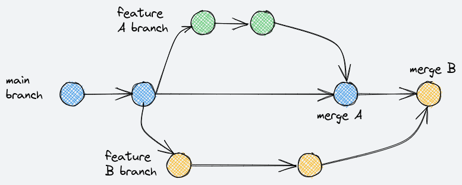

============
Installation
============

There are a number of ways to install this software.

Developer installation
======================

If you want to run it locally on your development system, typically
because you are developing and testing the code, then follow these
instructions.

* install `virtualenv` and install package dependencies:

    The dependencies are specified in the `requirements.txt` file
    at the root of the repository.

    Create a new virtual environment (optional but recommended) and
    run::

        virtualenv venv --python=python3
        . venv/bin/activate
        pip install -r requirments.txt

    The code assumes python version 3.10, see `Dockerfile` for details.

    create a file `.env` that has the following environment variables::

        GOOGLE_APPLICATION_CREDENTIALS="<path to json file>"
        GOOGLE_CLOUD_PROJECT = '<your gcp project id>'
        FITBIT_OAUTH_CLIENT_ID = '<your clientid>'
        FITBIT_OAUTH_CLIENT_SECRET = '<your client secret>'
        FITBIT_OAUTH_REDIRECT_URL = 'https://your.domain.com/path'

    Finally start the service with::

        flask run

    the application will run and show something like the following::

        * Serving Flask app 'app/app' (lazy loading)
        * Environment: development
        * Debug mode: on
        * Running on http://127.0.0.1:5000 (Press CTRL+C to quit)
        * Restarting with stat
        * Debugger is active!
        * Debugger PIN: 683-409-059

    Point your browser to the link from above to test the application.

Developer Installation using VSCode
===================================

If you use vscode, the provided devcontainer specification
will install the dpendencies automatically.  See
`dev containers <https://code.visualstudio.com/docs/remote/containers>`

Devcontainers are supported with vscode.dev and will automatically
configure a development container.

This container-based
development environment is defined by two files in `.devcontainer/`:
a `Dockerfile` that defines the base container, and a `devcontainer.json`
that configures the vscode environment.

Docker
======

The application comes with a `Dockerfile` for building a containerized
version of the application.

.. literalinclude:: ../Dockerfile
   :language: dockerfile

To build the container with Docker, simply::

    docker build .
    Successfully built 24c5457776b4

You can use docker commandline tool to determine the size of the container::

    docker image ls | grep 24c5457776b4
    24c5457776b4   14 minutes ago   168MB

and you can run the container using::

    docker run 24c5457776b4

To deploy the container in a runtime, the environment variables defined in
`.env` must be defined in the runtime environment for the container.
For example, running the docker container on the commandline will work if
you create an `.env-docker` file such as::

    GOOGLE_CLOUD_PROJECT=<snip>
    FITBIT_OAUTH_CLIENT_ID=<snip>>
    FITBIT_OAUTH_CLIENT_SECRET=<snip>
    FITBIT_OAUTH_REDIRECT_URL=http://127.0.0.1/services/fitbit/authorized
    OAUTHLIB_INSECURE_TRANSPORT=true
    FILE_GOOGLE_APPLICATION_CREDENTIALS=<BASE 64 encoded service account json>

The base64 encoded application credentials can be determined by creating
a service account with sufficient priviliges, downloading the json file, and::

    cat starterkit-service-account.json | base64 -w 0

The `-w` option ensures no line wrapping that can add characters to the string.

Once you have the variables defined in bash format, run the docker container::

    docker run --env-file .env-docker -p 5000:5000 24c5457776b4

where the last parameter is the container id.

Cloud Build
===========

The application
includes a `cloudbuild.yaml` file that works with Google Cloud and the `Dockerfile`
to build the container and register it into Google Cloud Registry.

.. literalinclude:: ../cloudbuild.yaml

to start the build, first make sure your `gcloud` environment is setup.  Take a look
at the following documentation `GCP Cloud Build <https://cloud.google.com/build/docs/building/build-python>`_
and once that is setup, use the command::

    gcloud build submit build=cloud_build.yml

This will upload the source material to gcp and use the `Dockerfile` to build and
register the container in gcr.  Once built, you can run it using regular docker
commands::

    docker run <gcr ref>

Gitlab CI
=========

The ci pipeline is defined in `.gitlab-ci.yml` and includes stages for building,
testing, and deploying the application.

To develop code, first create a branch off of the main branch
to do and test the changes.  In this picture, two independent changes are being
make in two seperate feature branches, `A` and `B`.  When `A` is complete it,
a merge request is made to the main branch.  At that point, the pipeline builds
and deploys the application in a staging area.  The application can be accessed
and tested.  If approved by the merge admin, then the changes are merged into the
main branch.

Similarly, the `B` feature branch is developed and tested in a staging area, before
being merged into the main branch.

When merging into the main branch, the application is packaged and deployed in
the production environment.
